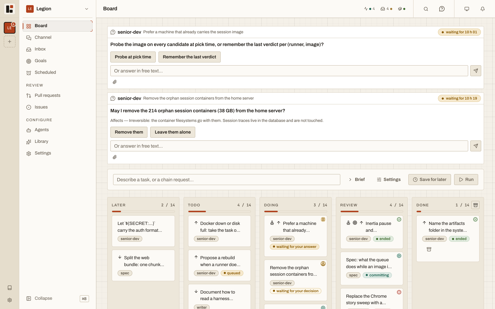
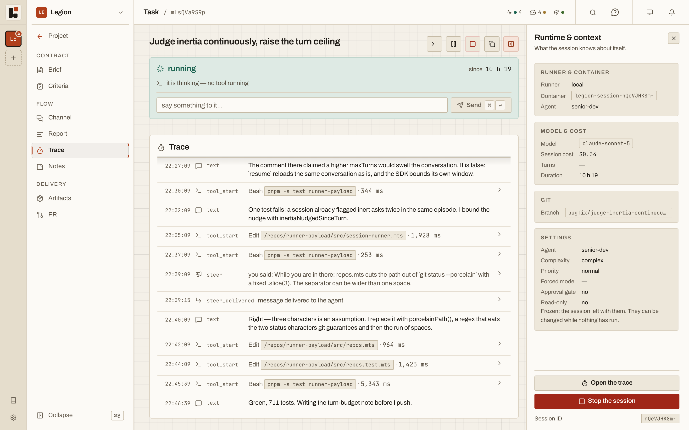
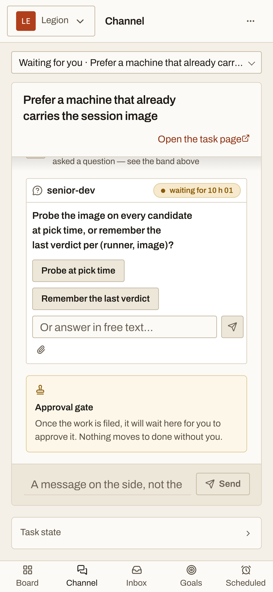
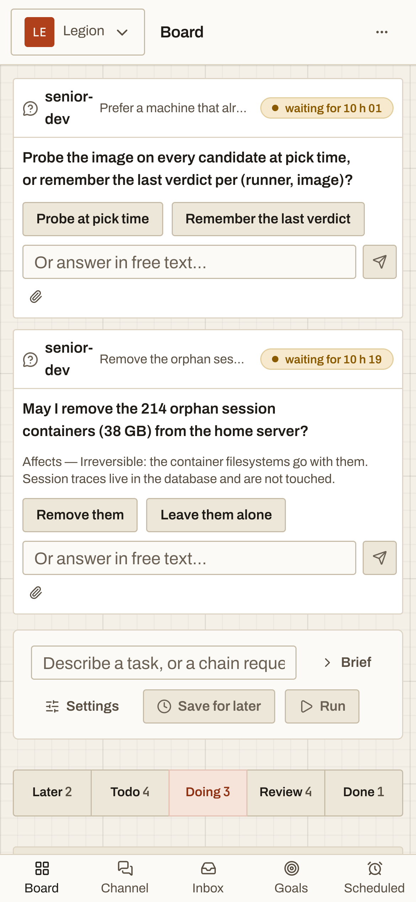
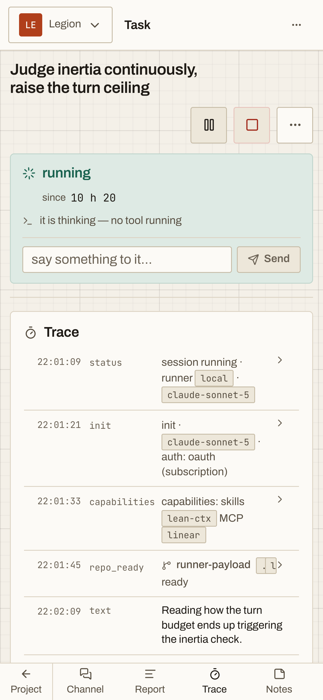
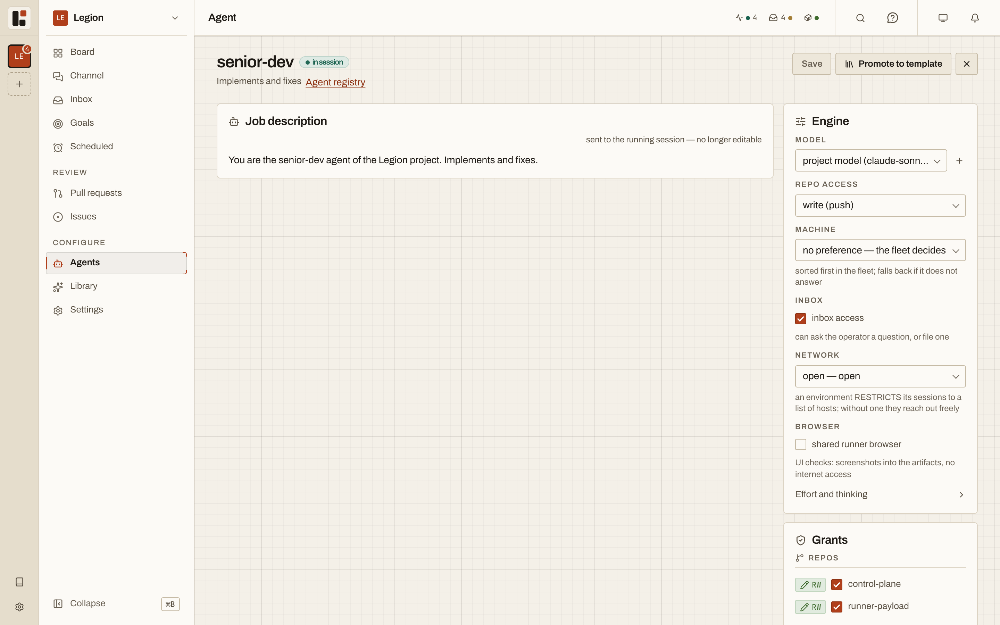
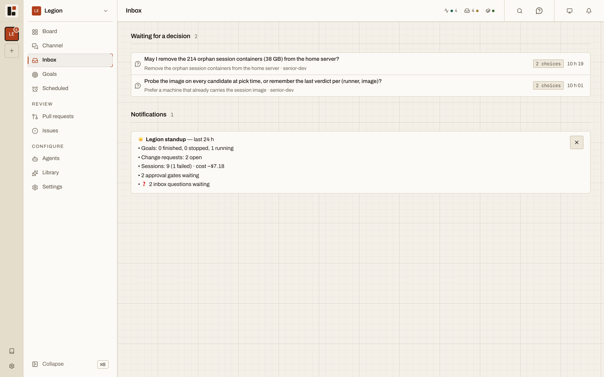

<p align="center">
  <picture><source media="(prefers-color-scheme: dark)" srcset="docs/assets/screens/desktop-board-dark.png"></picture>
</p>

# Legion

**Legion is a self-hosted control room for Claude agents: each task runs in a throwaway container with only the access you granted, and the agent comes to you when a decision is yours.**

<p>
  
  
  
  
  
</p>

Legion is a personal tool with one operator, built and used daily by its author. It is not built for teams, it is not offered as a hosted service, and it has not reached a stable release: interfaces and data still change between tags.

## What it does for you

You write a brief and assign an agent. Legion starts a container, clones the repositories that agent is granted, streams the trace to your screen, pushes the branch as the work goes, opens a pull request, destroys the container and moves the task to review. You read the diff, comment line by line, and send the agent back to work on the same branch, or merge.

<table>
  <tr>
    <td width="72%"><picture><source media="(prefers-color-scheme: dark)" srcset="docs/assets/screens/desktop-task-dark.png"></picture></td>
    <td width="28%"><picture><source media="(prefers-color-scheme: dark)" srcset="docs/assets/screens/phone-question-dark.png"></picture></td>
  </tr>
</table>

## The agent comes to find you

The agent comes to find you instead of waiting for you to come back. You launch a task at your desk, the agent hits a question two hours later, a push notification reaches your phone, you answer in the street, and the session starts again.

A waiting session has given back its container. It pushed its work, the container was destroyed, and nothing runs or costs while it waits. Answering from the phone is not remote control of a live process: it is the same gesture as from the desk, and a fresh container resumes with the same conversation and the same workspace.

The phone does more than answer. You can launch a task from it and follow its trace. The screen installs as a PWA and receives Web Push notifications, which is the recommended bridge: nothing to set up with a third party. There is no offline mode, on purpose: a service worker serving a cache would freeze the screen on a dead version.

<table>
  <tr>
    <td width="50%"><picture><source media="(prefers-color-scheme: dark)" srcset="docs/assets/screens/phone-board-dark.png"></picture></td>
    <td width="50%"><picture><source media="(prefers-color-scheme: dark)" srcset="docs/assets/screens/phone-trace-dark.png"></picture></td>
  </tr>
</table>

## Why it is built this way

| Choice | Why |
|---|---|
| One throwaway container per session | Nothing survives the container except what was pushed and what was said. An agent cannot break what it was never given. |
| Grants per agent, enforced by the server | An agent sees the repositories, folders, MCP servers, secrets and tools it was granted, and nothing else. A secret is injected only when it is ticked for that agent. |
| Approval gates enforced by the API | An agent told to close a gated task gets a refusal from the API. It does not read a sentence in its prompt asking it to refrain. |
| Work pushed during the session | Code is committed and pushed at intervals, not only at the end. A cut session, a quota hit or Docker going down costs a few turns, not the task. |
| The container dies while waiting | A question or an exhausted quota puts the session on hold instead of killing it. It resumes in a fresh container when the cause is lifted. |
| The inbox is the only interruption | An agent reaches you only through it. A question arrives with what the agent read and what your answer will change, so you decide from the list. |
| Merging stays human | The server opens a pull request for any session that pushed code, because an open pull request commits nobody. Approving a task, merging and approving a goal's definition of done are yours. |

<table>
  <tr>
    <td width="50%"><picture><source media="(prefers-color-scheme: dark)" srcset="docs/assets/screens/desktop-agents-dark.png"></picture></td>
    <td width="50%"><picture><source media="(prefers-color-scheme: dark)" srcset="docs/assets/screens/desktop-inbox-dark.png"></picture></td>
  </tr>
</table>

<p align="center">
  
</p>

## Security model

Two layers, which are not the same thing. The network decides who can reach the port. Legion decides who is allowed to act. Node has no address guard: the socket listens on every interface so that session containers can call back.

| Surface | Who reaches it | What it requires |
|---|---|---|
| Port 8790 | Whatever the network lets through | Nothing from Node. Limiting it is the job of the machine's firewall and your tailnet ACLs. |
| `/api/*` | The operator, from a browser or a tool | An operator session, opened by pasting the operator token once in the browser, or `Authorization: Bearer <token>`. Mutations also pass a same-origin check. |
| `/internal/*` | Session containers | The token of that container's own session. |
| `/webhooks/*` | Forges, through Tailscale Funnel | A signature: HMAC for GitHub, a secret header token for GitLab. It is the only public path. |
| The built screen | Whatever reaches the port | Nothing. It is client code and holds no data; every data call goes through `/api/*`. |

The operator token is generated at the first boot that finds none, printed once in the boot log, stored as a hash, and never enters a container. Secrets are encrypted in the database with AES-256-GCM, under a master key kept in `server/.env`.

Node serves plain HTTP on port 8790. HTTPS comes from a Caddy front end on the tailnet, and it is required for the phone: browsers only register a service worker, and so only allow the PWA and Web Push, on a secure origin.

Known limits: whoever holds the operator token is the operator. There are no accounts, no second factor, no rate limit on token checks, and a shell on the control plane machine gets past every guard.

## Before you install

To try it on your own machine:

| You need | Why |
|---|---|
| Node 22 or newer, and pnpm (`corepack enable pnpm`) | The control plane and the screen. |
| Docker, running | One container per session. Legion checks it before every launch and refuses cleanly if it does not answer. |
| A Claude credential | `CLAUDE_CODE_OAUTH_TOKEN` (from `claude setup-token`) or `ANTHROPIC_API_KEY`. Without one, sessions run in mock mode and produce no code; `make mock` shows the screen without Docker either. |

To follow it from your phone, or to run it on a server, add:

| You need | Why |
|---|---|
| A tailnet (Tailscale or equivalent), with ACLs | It decides who reaches the port. Your phone, your workstation and the machines that run sessions sit on it. Beyond your own machine, a private network is a prerequisite, not an option. |
| A domain and a Caddy front end | HTTPS for the PWA and Web Push. See [the TLS guide](docs/wiki/guides/tls.md). |

Even locally the server listens on every interface, so on a shared network (office, café) port 8790 is reachable by the other machines on it and the operator token is the only lock.

## Quickstart

On a development machine:

```bash
make setup
```

It installs the dependencies, creates `server/.env` from `server/.env.example`, and builds three Docker images: the session image, the egress proxy (Alpine and tinyproxy) and the shared browser, whose Playwright base weighs several gigabytes.

Fill in `server/.env`: the Claude credential, and `LEGION_MASTER_KEY` (generate it with `openssl rand -hex 32`; without it no secret can be stored). Then:

```bash
make dev
```

The screen is on `http://localhost:5173`, the API on `http://localhost:8790`. Copy the operator token from the server log on first boot and paste it in the browser. `make operator-token`, run on the control plane machine, sets a new one.

| Other ways to run it | Command |
|---|---|
| Without Docker or credentials, to work on the screen | `make mock` |
| On an always-on Linux server, screen and API on one port | `./deploy/up.sh`, after the steps in [Installing on a server](docs/wiki/guides/installer-sur-un-serveur.md) |
| Every target | `make` |

## Scope

| Area | Works | Planned or not finished |
|---|---|---|
| Tasks | Kanban board per project, queue, scheduled tasks, dependencies between tasks, attachments on a brief, read-only tasks | Artifacts are never cleared when a task is archived |
| Sessions | One container per session, live trace, cost, diff, artifacts, pushes during the session, pause and resume | A session's log lives in the control plane: a container that dies takes what it had not reported yet |
| Inbox and gates | Approval gates enforced by the API, questions and rounds of questions, drafts saved as you type | |
| Review | Line-by-line pre-review sent in one gesture; a pull request opened for any session that pushed code | |
| Phone | Installable PWA, Web Push notifications, layouts for narrow screens | No offline mode, by choice |
| Discord | A second, bidirectional bridge: a question's buttons answer the inbox. Needs your own bot, `DISCORD_BOT_TOKEN` and `DISCORD_CHANNEL_ID` | |
| Chains and goals | `feature` and `bugfix` chains; goals with guardrails on budget, duration and lack of progress | A goal's dollar budget only applies between two sessions |
| Grants | Repositories, folders, MCP servers, secrets, rules and skills, per agent or for the whole project | No screen to create a named agent (the API route exists) |
| Network isolation | An allowlist egress proxy when an agent is given a `limited` environment | Opt-in, off on every working agent; removing it was decided and is not done |
| Forges and providers | GitHub and GitLab: push, pull or merge request, inbound webhooks, OAuth or pasted token. Linear connection | Connections do not renew (a Linear connection dies after 24 hours). The Issues page reads only Linear |
| Claude credentials | API key or subscription token; several subscription accounts per project, with failover when one is exhausted | |
| Machines | Runners over `ssh://`, probed every 30 seconds; server install with an update button | The server's own runner stays off by default |
| Operator access | Operator session or bearer token | No sign-out button, no token rotation on screen, no second factor |
| Concierge | Read-only questions about the control plane, reading traces and tasks | Its situation report does not refresh on its own |

The full list, with the reasons, is in [where the product stands](docs/wiki/produit/etat.md).

## Documentation

The wiki is served in the app at `/wiki`, opens as is in Obsidian, and is present in every session's clone, so an agent can read it from its container.

| Section | What it answers |
|---|---|
| [`docs/wiki/produit/`](docs/wiki/produit/) | What Legion is, who it is for, its principles, its decisions and where it stands |
| [`docs/wiki/concepts/`](docs/wiki/concepts/) | Agent, project, task, session, runner, forge |
| [`docs/wiki/guides/`](docs/wiki/guides/) | Getting started, installing on a server, TLS, push notifications, inbound webhooks, grants, chains, quotas |
| [`docs/wiki/reference/`](docs/wiki/reference/) | Statuses and troubleshooting |
| [`docs/diagrams/`](docs/diagrams/) | Interactive diagrams: [architecture](docs/diagrams/architecture.html), [session lifecycle](docs/diagrams/session-lifecycle.html), [task workflow](docs/diagrams/task-workflow.html), [phone path](docs/diagrams/phone-path.html) |

| Folder | Role |
|---|---|
| `server/` | The control plane: Hono, Drizzle and SQLite, routes, the event stream, runners |
| `web/` | The screen: React 19 and Vite |
| `runner-payload/` | What runs inside the container: the Agent SDK, Legion's MCP server, session guardrails |
| `session-image/` | The session image |
| `deploy/` | The server install: one container serving the API and the screen |

## License

[MIT](LICENSE)
